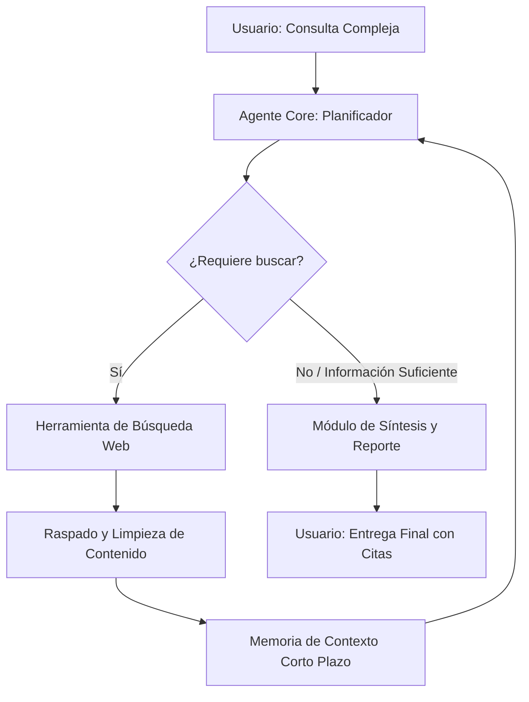

# ContextWeb AI 🔍🌐


**ContextWeb AI** es un agente autónomo de inteligencia artificial diseñado para la investigación automatizada en la web. A diferencia de los buscadores tradicionales, este agente comprende el contexto de consultas complejas, planifica una estrategia de búsqueda, navega por internet de forma independiente, extrae contenido relevante y genera reportes consolidados listos para la toma de decisiones.

Este proyecto fue desarrollado para demostrar la implementación práctica de arquitecturas de agentes, sistemas RAG (Retrieval-Augmented Generation) y optimización de prompts.

## 🚀 Características Clave

* **Navegación Autónoma:** Planifica y ejecuta búsquedas multi-paso basadas en objetivos generales, no solo en palabras clave.
* **Extracción de Contenido Limpio:** Raspa y procesa páginas web eliminando código basura, publicidad y elementos irrelevantes para quedarse solo con el texto semántico.
* **Síntesis y Curación de Datos:** Consolida información de múltiples fuentes web independientes, eliminando duplicados y contradicciones.
* **Caspas de Seguridad y Verificación:** Filtra fuentes no confiables y formatea las respuestas finales incluyendo citas y enlaces directos a las fuentes originales.

## 🛠️ Arquitectura y Tecnologías

El proyecto se construyó bajo una arquitectura modular que separa la lógica de razonamiento de las herramientas de ejecución:

* **Core de IA:** [LangChain / CrewAI] utilizando modelos de lenguaje avanzados (`gpt-4o` / `claude-3-5-sonnet`).
* **Herramientas de Búsqueda:** Integración con [Tavily Search API / Serper API] optimizadas para agentes de IA.
* **Procesamiento de Texto:** [BeautifulSoup / Playwright] para el web scraping dinámico.
* **Interfaz de Usuario (Opcional):** [Streamlit / FastAPI] para interactuar visualmente o mediante endpoints con el agente.



## 📋 Requisitos Previos

Antes de configurar el proyecto, asegúrate de tener:
* Python 3.10 o superior instalado.
* Una clave de API de tu proveedor de LLM (OpenAI, Anthropic, etc.).
* Una clave de API para el motor de búsqueda (Tavily, Serper, etc.).

## 🔧 Instalación y Configuración

1. **Clonar el repositorio:**
   ```bash
   git clone https://github.com
   cd ContextWeb_AI
   ```

2. **Crear y activar un entorno virtual:**
   ```bash
   python -m venv venv
   # En Windows:
   venv\Scripts\activate
   # En macOS/Linux:
   source venv/bin/activate
   ```

3. **Instalar dependencias:**
   ```bash
   pip install -r requirements.txt
   ```

4. **Configurar variables de entorno:**
   Crea un archivo `.env` en la raíz del proyecto y añade tus credenciales:
   ```env
   OPENAI_API_KEY=tu_openai_key_aqui
   TAVILY_API_KEY=tu_tavily_key_aqui
   ```

## 💻 Uso

Para ejecutar el agente desde la consola, corre el script principal:
```bash
python main.py --query "Analiza el estado actual de la fusión nuclear comercial en 2026"
```

El agente guardará un archivo `reporte_investigacion.md` en la carpeta de salida con los resultados estructurados y sus respectivas fuentes.

## 📈 Desafíos Técnicos y Aprendizajes

* **Manejo de Alucinaciones:** Implementé un sistema de verificación cruzada donde el agente evalúa si el texto extraído realmente responde a la pregunta antes de incluirlo en el reporte final.
* **Límites de Rate Limit:** Optimicé las llamadas a la API agrupando las consultas y limitando la profundidad de la búsqueda para mantener el proyecto dentro de costos eficientes de producción.
* **Scraping Dinámico:** Superé el bloqueo de páginas estáticas implementando un parseador adaptativo capaz de extraer el cuerpo principal del texto sin importar la estructura del HTML.

## 📄 Licencia

Este proyecto está bajo la Licencia MIT. Consulta el archivo `LICENSE` para más detalles.
